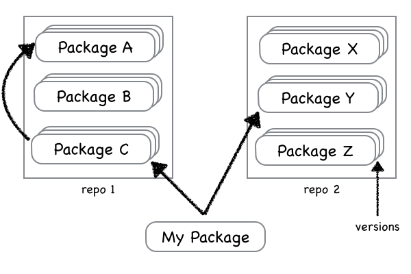

# cdist - C/C++ dependency manager

C/C++ does not have standardised and efficient dependency manager like python-pip, ruby's gems, rust's cargo. There are only build systems like gnu autotools/make, scons, cmake and others.

Recent [biicode](https://www.biicode.com) project tries to solve this problem and provide modern solution for dependency management, but requires for all projects to use biicode. In terms of software systems it's highly intrusive, you can not use third-party written in old 80-th or 90-th project without changing it and adopting to biicode format, which leaves a lot of already written code out of the boat - the main power of c/c++ in 21th century. There are another drawbacks of biicode which prevent it from becoming widely-used tools like

- keeping code itself in biicode repositories, which duplicates VCS (git, svn, mercurial)
- not having prebuilt binaries for widely-used configurations/platforms like [homebrew](http://brew.sh) does.
- single repository stops private companies to use biicode *for* it's projects because of  trust questions.

cdist tries to solve outlined problems and combine the best of popular package/dependency managers and homebrew to build solid platform for painless development of c/c++ projects.

# Key Concepts

- Does not rely on particular build system, rather provide interface for different build systems and ready patterns for popular build systems like make, cmake, scons.
- Use version control systems as a source of sourcecode wherever possible with handling of branches and tags.
- Use decentralised infrastructure where it is possible to setup your own cdist repo and allow projects to mix dependencies from different cdist repos.
- Provide package versioning so it is possible to depend on specific version of a library.
- Use wherever possible prebuilt library binaries to avoid complex build and waste of time like homebrew bottles. Make it optional so you can always force to build dependencies from source.
- Make every build reproducible, so each time i rebuild my project i got the same dependencies even if world changes. To update libraries to newer versions you need to change dependencies list.

# Design

Every project in cdist called package: executable or library. Packages constitute repositories and can be duplicated across repositories like forks in VCS. Repository is a unit of decentralisation, i.e. every company can setup it's own repository and hold private code there (actually hold links to private code there).



Dependencies are explicitly written in dedicated file describing project/package. Here brief overview of this file (yaml format).

```yaml
id: My Package
source: git://example.com/group/repo.git
deps:
	- repo1/packageC@1.2
	- repo2/packageY@3.8
options:
	A:
		flags: ...
		defines: ...
		deps: ...
	B:
		flags: ...
		defines: ...
		deps: ...		
build:
	- ./configure $FLAGS --prefix $PREFIX
	- make
	- make install
```

Project defines source repo/archive, defines it's dependencies, options and build rules.

Option is a set of flags, defines and dependencies. during build or defining dependency it is possible to define option's list. During parsing special variable `$FLAGS` is built based on global configuration and options used.

Build phase is last and make binary library according to the rules in build section. A special variable `$PREFIX` is a path where it build rules should finally store include files and binary files in `include/` and `lib/` subfolders respectively.

For known build systems build section is replaced with
```yaml
build_system: cmake
```

So only one of `build` and `build_system` section is present in package description.

# Open problems

- inherit defines and flags from dependencies. Say library A is build with define `FOO`, we should also define `FOO` in dependant project to avoid potential divergency in preprocessed header files and built library binaries.
- using several versions of the same library. Simple solution is to reject such things.
- defining shared or static library
- non orthogonal options: leave problems up to user or try to handle it?
- is options syntax enough for all build systems?
- what about compiler specific flags, how to handle it?
- release and debug versions? The most simple solution is to have to build sections except for known build systems like cmake and conf.

